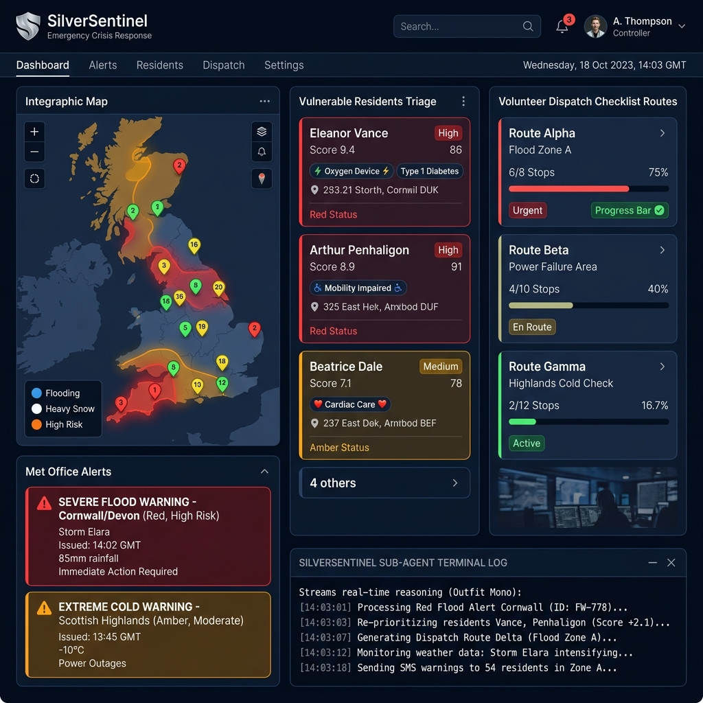
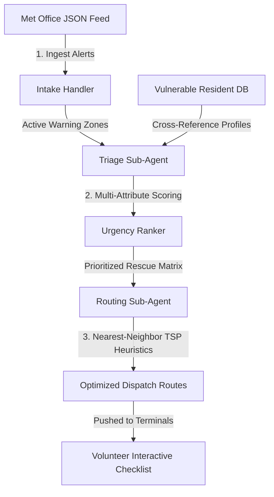

# 🛡️ SilverSentinel: Automated Severe Weather Triage & Dispatch Agent

SilverSentinel is a complete, production-ready backend orchestration and dashboard system built for emergency crisis response. It functions as an automated extreme weather triage and emergency dispatch agent designed to protect vulnerable, isolated older citizens in the UK during severe weather hazards (e.g., floods, deep freezes, gale storms).

The system features a **multi-attribute risk priority scoring matrix**, a **nearest-neighbor travel optimization engine**, and a high-contrast, accessible **Crisis Volunteer Dashboard** equipped with an interactive geographic SVG map and a live agent reasoning log console.

---

## 📸 System Dashboard Interface

Here is a visual preview of the SilverSentinel Crisis Command Center:



> [!NOTE]  
> *A copy of this generated screenshot has been saved to your conversation workspace directory. Copy it into your project folder as `dashboard.png` before pushing to GitHub to display the image on your repository home page.*

---

## 🛠️ Architecture & Pipeline Overview

SilverSentinel processes weather emergencies and coordinates rescue teams through three distinct pipeline stages:



### 1. Phase 1: Weather Alert Intake
The intake handler ingests simulated Met Office JSON alert feeds specifying warning severity levels (**Red**, **Amber**, **Yellow**), hazard classifications (**Severe Flash Flooding**, **Deep Freeze & Black Ice**, **Gale Force Winds**), and targeted postcode sectors (e.g., London Pimlico `SW1V`, Edinburgh Royal Mile `EH1`, Liverpool Albert Dock `L3`).

### 2. Phase 2: Sub-Agent Risk-Triage Engine
When a hazard triggers, a sub-agent cross-references the targeted sectors with the vulnerable resident database (containing profiles with attributes like age, mobility score, medical device dependency, and living status). It computes a **Priority Score** for each affected resident:

$$\text{Priority Score} = (\text{Age} - 65) \times 0.4 + (\text{Mobility Score} \times 1.5) + (\text{Medical Device Dependency} \times 6.0) + (\text{Lives Alone} \times 2.0) + (\text{Medical Condition} \times 2.0) + \text{Severity Points} + \text{Synergy Modifiers}$$

#### Scoring Attribute Weights
| Attribute | Risk Factor Weight | Details |
| :--- | :--- | :--- |
| **Age Vulnerability** | `+0.4` per year over 65 | Accounts for decreased thermal regulation and physiological stress |
| **Low Mobility** | `Mobility Score (1-5) * 1.5` | Scales priority for residents requiring physical rescue assistance |
| **Medical Device Dependent** | `+6.0` points | Applied if resident requires electricity for oxygen, dialysis, etc. |
| **Living Isolated** | `+2.0` points | Applied if the resident lives alone with no household support |
| **Medical Condition** | `+2.0` points | Accounts for chronic conditions (e.g. advanced dementia, arthritis) |
| **Weather Severity** | `Red: +5.0`, `Amber: +3.0`, `Yellow: +1.5` | Reflects the immediate severity of the incoming storm front |

#### Synergistic Hazard Modifiers
*   **Deep Freeze + COPD Condition**: Adds an extra **`+3.0`** points (elevated respiratory hazard).
*   **Flash Flooding + Low Mobility ($\ge 4$)**: Adds an extra **`+3.5`** points (high drowning/confinement risk).

Residents are categorized into color-coded urgency bands:
*   🔴 **`CRITICAL (Immediate Dispatch)`**: Score $\ge 18$
*   🟠 **`HIGH (Same Day Visit)`**: Score $\ge 12$
*   🟡 **`MEDIUM (Contact / Check)`**: Score $\ge 7$

### 3. Phase 3: Route Optimization & Crisis Dispatch
The dispatch sub-agent groups prioritized residents by region and runs a **Nearest-Neighbor Traveling Salesperson (TSP)** algorithm to order visits, starting from the highest-priority resident's postcode sector (acting as the local rescue hub) and routing to adjacent coordinates. 

The agent appends emergency protocol action lists based on the weather hazard and resident requirements:
*   *Deep Freeze Protocol*: Deliver high-thermal blankets, test backup heaters, check calorie reserves.
*   *Flash Flood Protocol*: Relocate critical medical gear to upper floors, inspect entrance water levels, prepare evacuation routes.
*   *Device Dependency Protocol*: **CRITICAL** verification of auxiliary battery backups.

---

## 📂 Project Directory Structure

```
silver-sentinel/
├── .agents/
│   └── skills/
│       └── silversentinel/
│           └── skill.yaml     # Custom Antigravity agent workflow definitions
├── src/
│   ├── core/
│   │   ├── triage.js          # Core multi-attribute risk scoring
│   │   └── dispatch.js        # Nearest-neighbor TSP routing and action protocols
│   ├── mock/
│   │   └── mock-generator.js  # Generates 50 resident profiles and UK postcode markers
│   └── utils/
│       └── geo.js             # Great-circle Haversine distance calculations
├── public/
│   ├── index.html             # High-contrast accessible dispatch center dashboard
│   ├── style.css              # Custom styling with HSL color tokens and grid panels
│   └── app.js                 # UI logic with embedded client-side fallback engine
├── run-sentinel.js            # CLI harness, test assertion runner, and server host
├── README.md                  # Detailed repository documentation
└── dashboard.png              # System screenshot visualization
```

---

## 🖥️ Live Volunteer Dashboard Features

Designed for fast-paced emergency management under low-light or stressful conditions:
1.  **Interactive Geographic SVG Map**: projects postcode lat/lon points onto a dynamic UK scatter plot map. Pulsing glows outline active hazard zones. Clicking a resident's pin on the map auto-scrolls to and highlights their detail card.
2.  **Sub-Agent Live Reasoning Console**: Streams agent logs at the bottom of the interface, showcasing the agent's calculations, database scans, scoring decisions, and route generation logs.
3.  **Quick Category Filters**: Instant buttons to filter by risk type (*🔌 Medical Device*, *♿ Low Mobility*, *🏠 Living Alone*, or *🫁 COPD*).
4.  **Route Completion Trackers**: Animate-filling progress bars automatically update route metrics (e.g. `3/5 Visited (60%)`) as volunteers complete dispatch checklists.
5.  **Robust Client-Side Fallback**: Built-in client-side engine executes all triage math in-browser if the Node.js API server is unreachable, making the dashboard fully functional via direct HTML double-click.

---

## 🚀 Execution & Setup Instructions

### Prerequisites
*   Node.js (v14 or higher)

### Setup
1. Clone the repository:
   ```bash
   git clone https://github.com/Master-SC/silver-sentinel.git
   cd silver-sentinel
   ```

2. Run the automated test assertion suite (validates triage math, Haversine formula, and TSP routing):
   ```bash
   node run-sentinel.js --test
   ```

3. Run a quick CLI console simulation report:
   ```bash
   node run-sentinel.js
   ```

4. Launch the local HTTP web server to host the dashboard and APIs:
   ```bash
   node run-sentinel.js --serve
   ```
   Open **`http://localhost:3000`** in your browser.
